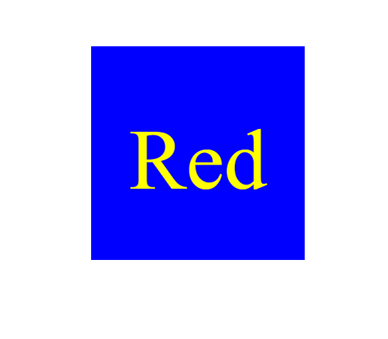
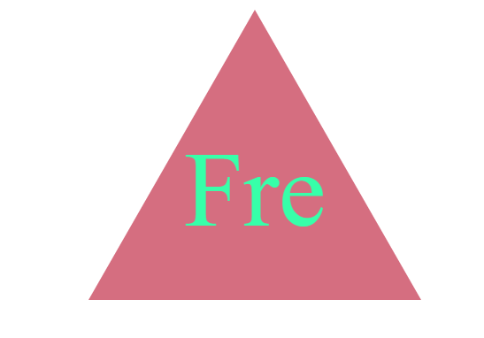

# OOP-SVG-logo-Maker-Mutasim

## Description
This node application allows a user to make a logo in a svg files using user inputs. it ask the user for the text shape and colour of the logo and outputs a logo fitting their requirements. This also uses jest to test some of the classes i have used. It can also take hex colour codes aswell.

## Instillation
Make your way to the directory where the index.js file is. Then run the command "npm i inquirer@8.2.4". then once the package is downloaded, run the command 'node index.js'. Then you will be presented with the questions.
To run the tests run 'npm i -D jest' to install jest, then run 'npm run test'. alternatively you can just run npm i and it will install all the packages needed , then you only need to run 'node index.js' for the application and 'npm run test' to run the test.

## Link
https://drive.google.com/file/d/1xENkpkKDeo38lYBKbswlsXsyT1lE61yI/view

## ScreenShots

this is the logo when the user inputs 'red', 'yellow','square','blue'

this is the logo when the user inputs 'Fre', '#37ffa9', 'triangle', '#d56e80'
